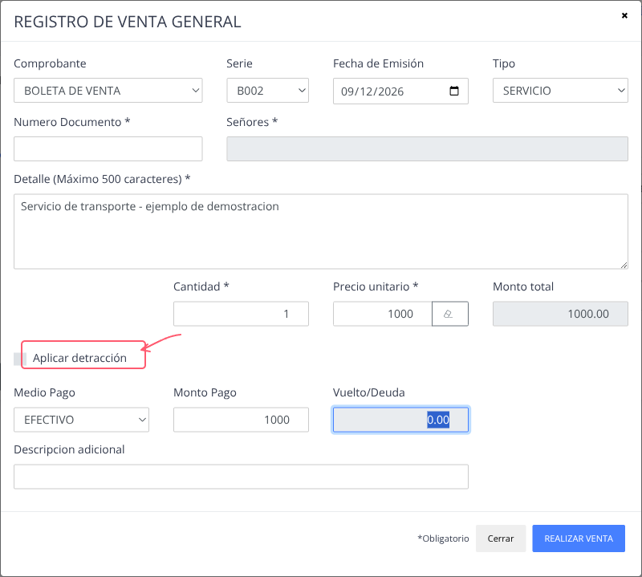
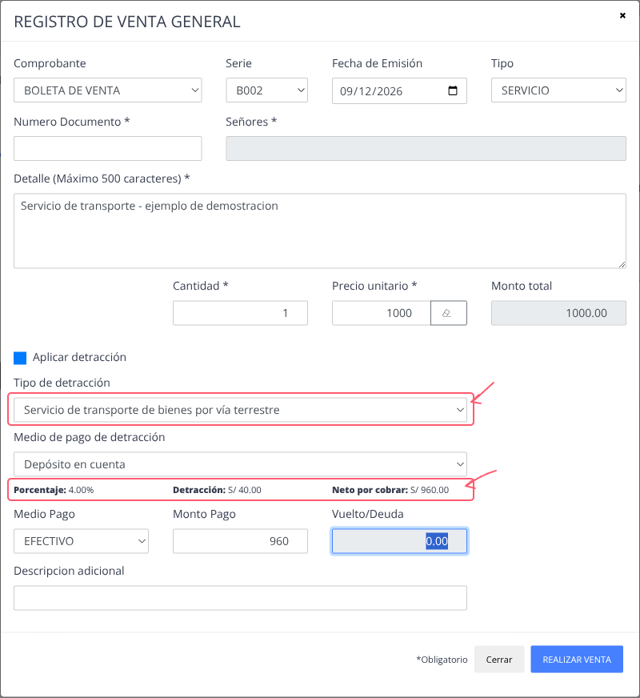

# Registrar venta general

Registre una venta general con comprobante electrónico desde las operaciones de
ingresos. Este flujo corresponde a ventas con **Factura** o **Boleta**; no se
usa para pasajes ni encomiendas.

## Ruta rápida

1. Vaya a **Operaciones de ingresos y egresos**.
2. Abra la pestaña **Ingresos**.
3. Seleccione **Ingreso con Facturación**.
4. Complete el comprobante, el cliente, el detalle, el pago y confirme con
   **REALIZAR VENTA**.

## Completar la venta

1. Seleccione el comprobante y una serie compatible. Use **Factura** o
   **Boleta** según corresponda.
2. Ingrese la fecha de emisión dentro del rango permitido por el formulario.
3. Complete los datos del cliente. Para una factura, el formulario solicita un
   RUC de 11 dígitos.
4. Ingrese el detalle, la cantidad, el tipo y el precio unitario. El sistema
   calcula el **Monto total**; verifique que represente la venta antes de
   continuar.
5. Seleccione el medio de pago y complete los datos de pago solicitados. Si el
   formulario muestra **Vencimiento**, verifique la fecha antes de confirmar.
6. Revise el comprobante y la serie en la confirmación y seleccione
   **SI REGISTRAR**.

## Detracción opcional

La opción **Aplicar detracción** aparece solo cuando su organización tiene la
función y los catálogos necesarios disponibles.

1. Antes de activarla, ubique **Aplicar detracción** junto al monto total y los
   datos de pago. En el ejemplo, los campos de cliente están vacíos y los datos
   de venta son solo demostrativos; no se ha registrado una venta.

   

   *Antes de activar la detracción, revise el contexto general de la venta y el monto total.*

2. Active **Aplicar detracción**. Seleccione el tipo de detracción y el medio
   de pago de detracción que correspondan a la operación.

   

   *Después de activarla, el ejemplo muestra un tipo de transporte de bienes por vía terrestre y su cálculo.*

3. Revise el porcentaje, el importe de detracción y el **Neto por cobrar** que
   muestra el formulario. El tipo y porcentaje mostrados en el ejemplo pueden
   variar según la configuración y la aplicación tributaria de la operación.
4. Use el neto por cobrar para verificar el monto de cobro antes de registrar
   la venta.

El cálculo parte del monto total de la venta, obtenido de cantidad por precio
unitario. No se aplica automáticamente por un monto mínimo: active la opción
solo conforme a los criterios definidos por su organización. Esta guía no
determina la aplicación tributaria de la detracción.

Si la opción no está disponible, aparece un aviso de configuración o se muestra
el aviso de cuenta bancaria, contacte al administrador. No modifique parámetros
del sistema para continuar con la venta.
