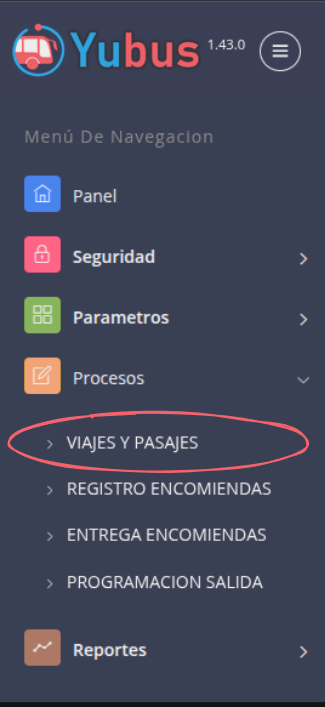
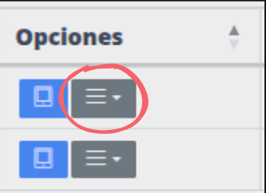
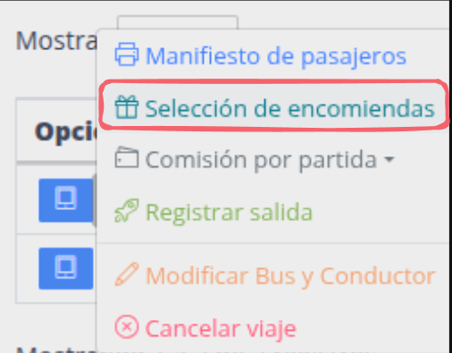
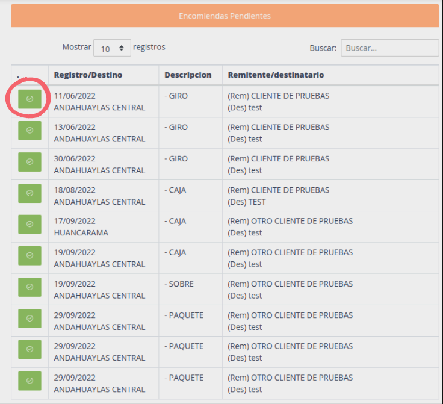
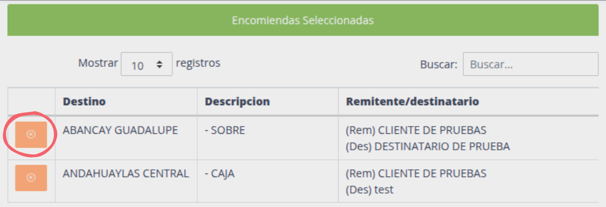

# Asignación de encomiendas

Si se tiene encomiendas sin asignar, estos pueden ser asignados desde el modulo de viajes y pasajes.

Pasos:

1. [Ir a viajes y pasajes](#ir-a-viajes-y-pasajes)
2. [Ir a seleccion de encomiendas](#ir-a-seleccion-de-encomiendas)
3. [Asignar encomiendas](#asignar-encomiendas)

## Ir a viajes y pasajes

## Ir a seleccion de encomiendas

> 1. Click menu opciones viaje
> 2. Click selección de encomiendas

## Asignar encomiendas

> Click boton verde para asignar encomienda, automaticamente pasara a "encomiendas seleccionadas".

> Se puede desasignar una encomienda haciendo click en el boton naranja desde la lista de "encomiendas seleccionadas".

