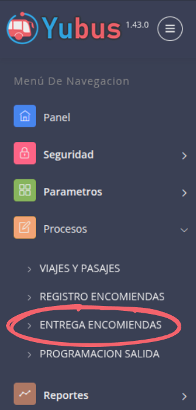
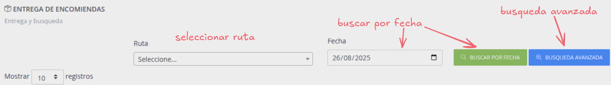
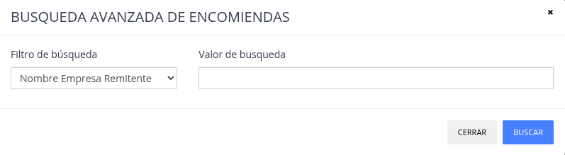
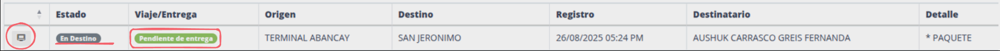
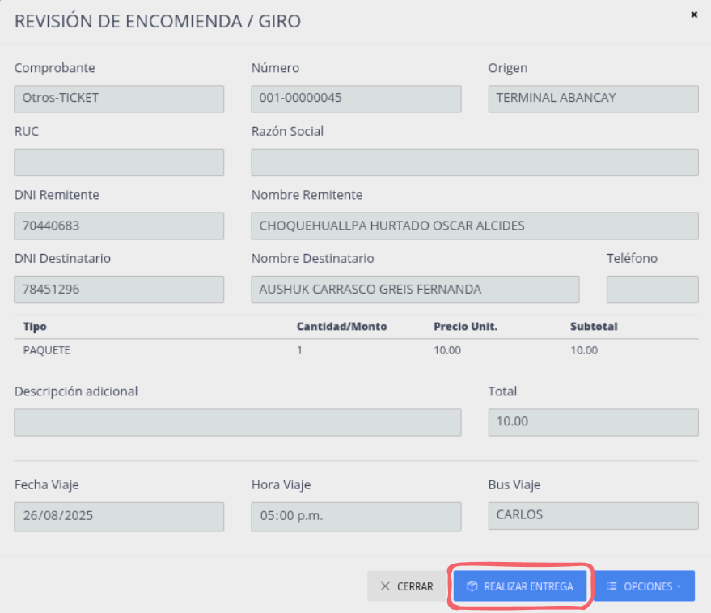
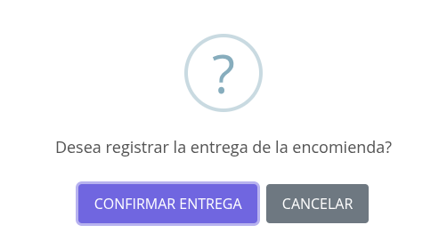

# Salida y entrega de encomiendas

## Salida de encomiendas

Cuando se [registra la salida de un bus (inicia un viaje)](../trips/register_departure.md),
automaticamente las encomiendas asignadas a ese viaje tambien registran su salida. Por ende no es un proceso
que se realice manualmente.

## Entrega de encomiendas

Cuando se [registra la llegada de un bus (finaliza un viaje)](../trips/register_arrival.md)
automaticamente las encomiendas asignadas a ese viaje pasan del estado "vigente" a **"en destino"**.

Toda encomienda que este marcado con el estado **"en destino"** es valido para ser entregado.

Pasos:

1. [Ir a entrega encomiendas](#ir-a-entrega-encomiendas)
2. [Buscar encomienda](#buscar-encomienda)
3. [Abrir detalles de encomienda](#abrir-detalles-de-encomienda)
4. [Realizar entrega](#realizar-entrega)
5. [Cofirmar entrega](#confirmar-entrega)

### Ir a entrega encomiendas

### Buscar encomienda

> Se puede buscar por ruta y fecha, para buscar por otros parametros click en "busqueda avanzada".

#### Busqueda avanzada

> Parametros de busqueda:

> * Doc. Empresa remitente
> * Nombre empresa remitente
> * Doc. Cliente remitente
> * Nombre cliente remitente
> * Doc. Destinatario
> * Nombre destinatario

### Abrir detalles de encomienda

> * Ubicado la encomienda a entregar.
> * Verificar "Estado" (en destino) y "Viaje/Entrega" (pendiente de entrega).
> * Click en el boton al inicio de la fila.

### Realizar entrega

> Click boton "Realizar entrega".

### Confirmar entrega

