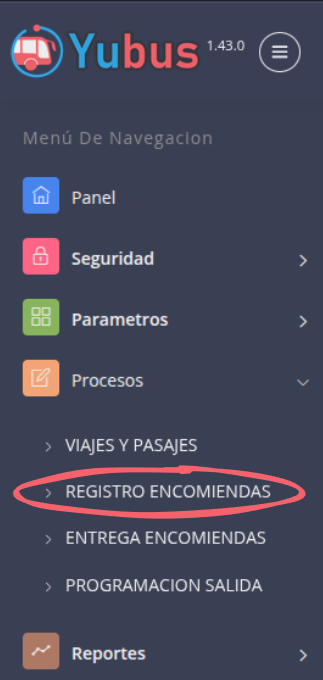
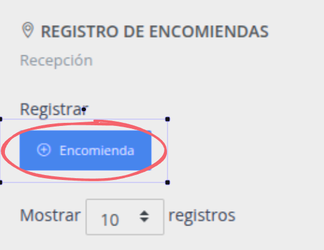
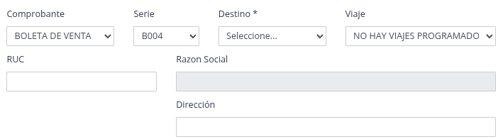
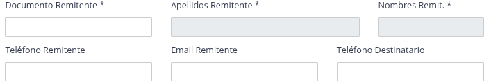
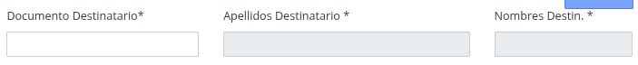
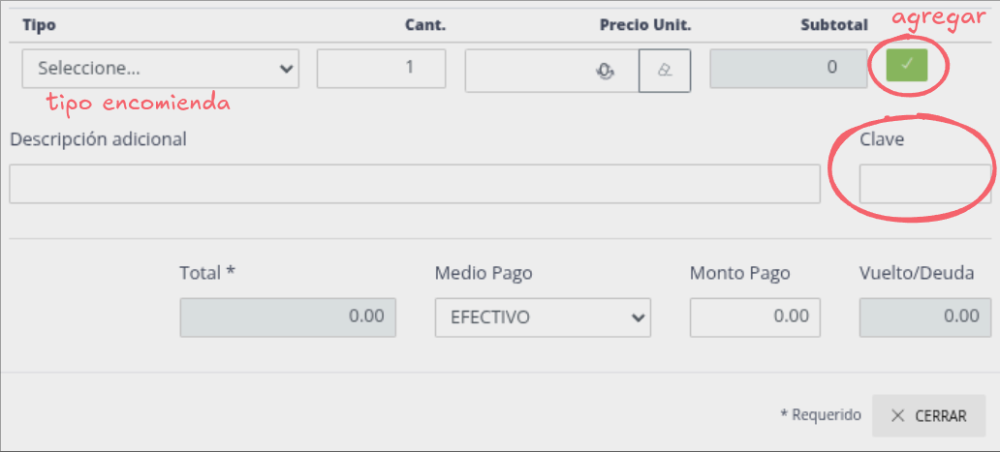

# REGISTRO ENCOMIENDAS

Pasos:

1. [Ir a registro encomiendas](#ir-a-registro-encomiendas)
2. [Click boton Encomienda](#click-boton-encomienda)
3. [Completar datos iniciales](#completar-datos-iniciales)
4. [Completar datos remitente](#completar-datos-remitente)
5. [Completar datos destinatario](#completar-datos-destinatario)
6. [Completar datos finales](#completar-datos-finales)

# Ir a registro encomiendas

# Click boton Encomienda

# Completar datos iniciales

> 1. Comprobante: Puede ser boleta, factura o ticket
> 2. El destino puede ser una parada intermedia o el paradero final
> 3. En facturas el ruc y razon social es obligatorio, para otros documentos es opcional

# Completar datos remitente

> 1. Ingresar DNI
> 2. Apellidos y nombres se autocompletan según el DNI
> 3. Los demas datos son opcionales, sin embargo se recomienda ingresar los telefonos

# Completar datos destinatario

> 1. Ingresar DNI
> 2. Apellidos y nombres se autocompletan según el DNI

# Completar datos finales

> 1. Seleccionar tipo de encomienda: caja, bolsa, paquete, etc.
> 2. Modificar cantidad si es necesario.
> 3. Modificar precio unitario si es necesario.
> 4. Verificar subtotal.
> 5. Click boton verde para agregar a la lista.
> 6. La descripción es opcional, meramente referencial. 
> 7. Ingresar la **"CLAVE"**, que sera requerida en el destino
> 8. Seleccionar medio de pago
> 9. Si no se ingresa un monto a pagar entonces estara marcado para cobrar en el destino.
> 10. Click boton Cerrar

