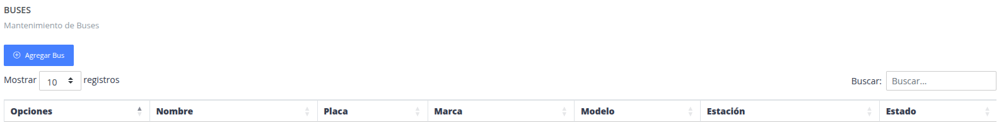
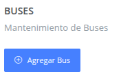
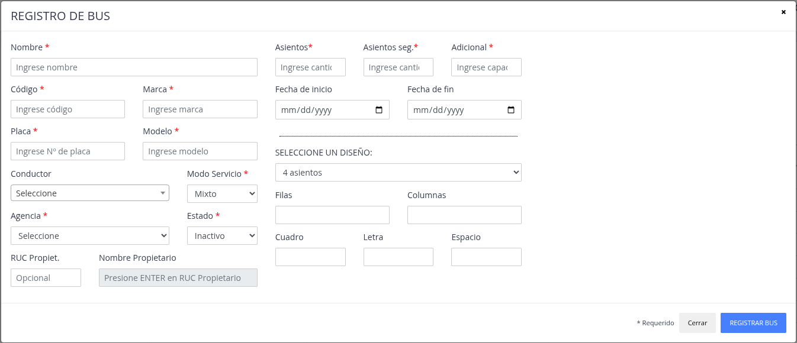
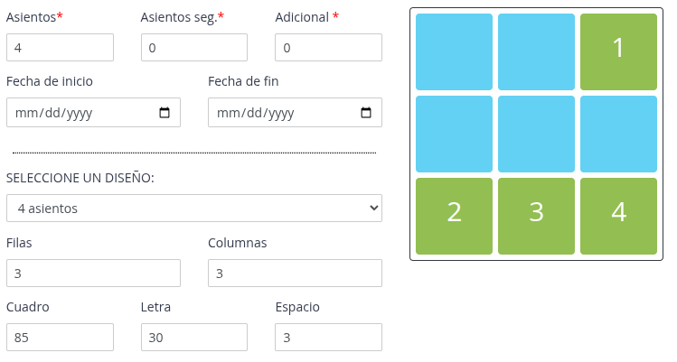
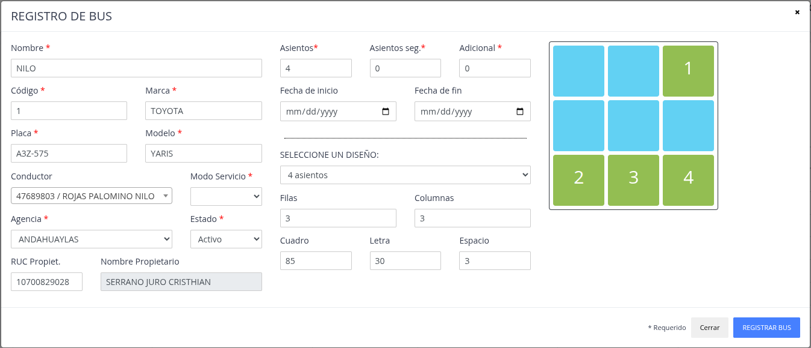
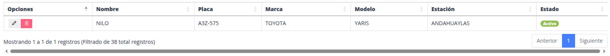

# Buses

Lista de buses registrados en el sistema.

## Registrar nuevo bus

> ### Presione la opción "Agregar bus"

> ### Datos del formulario

Datos a considerar:

- **Conductor:** seleccione el conductor asignado al bus, si corresponde.
- **Modo Servicio:** seleccione `Mixto`, `Pasajero` o `Carga`. Este dato clasifica los viajes y los agrupa al registrar una encomienda.
- **Capacidad:** los campos `Asientos`, `Asientos seg.` y `Adicional` aceptan el valor `0`. Para un bus de carga sin asientos de pasajeros, registre `0` en los dos campos de asientos y consigne la capacidad adicional que corresponda.
- **Distribución:** registre y conserve una distribución del bus. La vista de asientos de las unidades de carga no está disponible, pero el sistema utiliza la distribución guardada al abrir el detalle del viaje.

> ### Nuevo "Bus"

## Actualizar / Eliminar

> ### Actualizar

El sistema brinda la posibilidad de modificar datos
de un bus ya registrado.

> ### Eliminar

Sirve para poder quitar del proceso de viajes/encomiendas a un bus.
