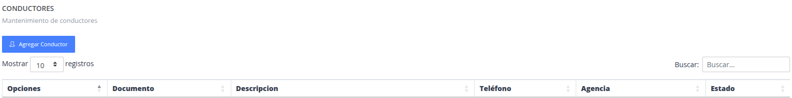
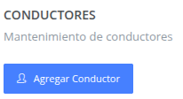
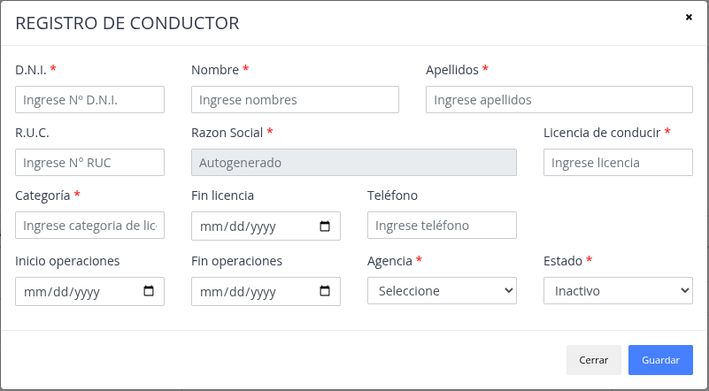
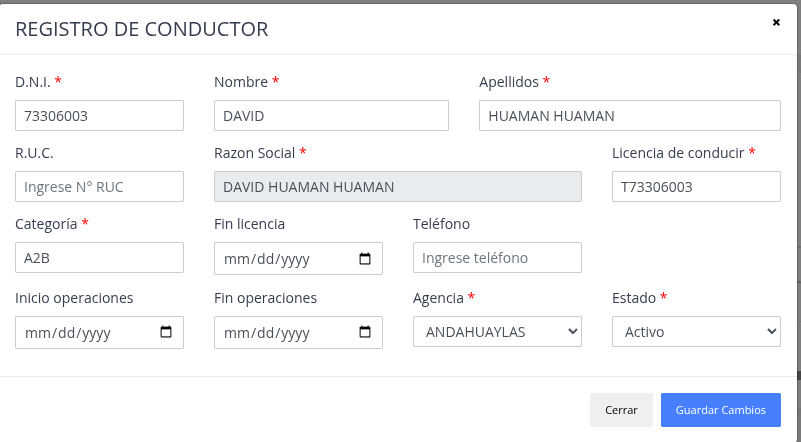
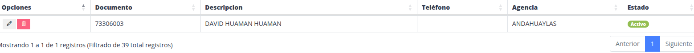

# Conductores

Lista de los conductores del sistena.

## Registrar nuevo conductor

> ### Presione la opción "Agregar cliente"

> ### Datos del formulario

Datos a considerar:

- Se puede buscar por el campo DNI O RUC para generar los nombres/apellidos del conductor

> ### Nuevo "Conductor"

## Actualizar / Eliminar

> ### Actualizar

El sistema brinda  la posibilidad de modificar datos
de un conductor ya registrado.

> ### Eliminar

Sirve para poder quitar y no listar un conductor.