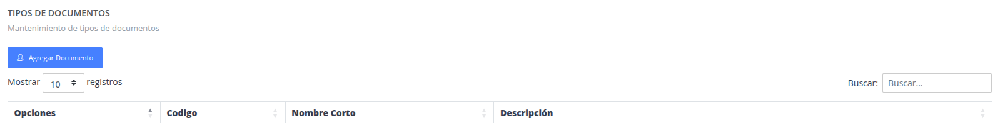
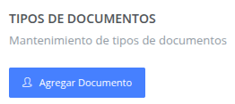
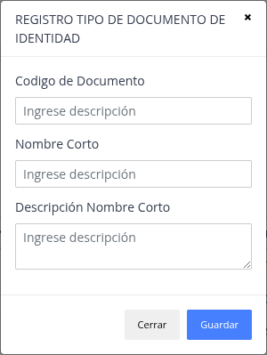
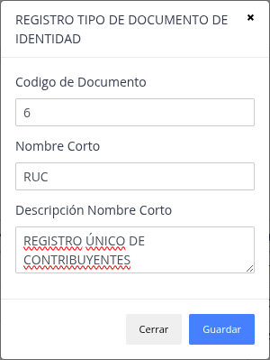
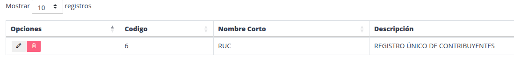

# Documentos de identidad

Son los tipos de documentos que se acepta en el negocio con respecto a sus clientes.

## Registrar nuevo documento de identidad

> ### Presione la opción "Agregar documento"

> ### Datos del formulario

> ### Nueva documento de identidad

## Actualizar / Eliminar

> ### Actualizar

El sistema brinda  la posibilidad de modificar datos
de un documento de identidad ya registrado.

> ### Eliminar

Sirve para poder quitar y no utilizar un documento de identidad.