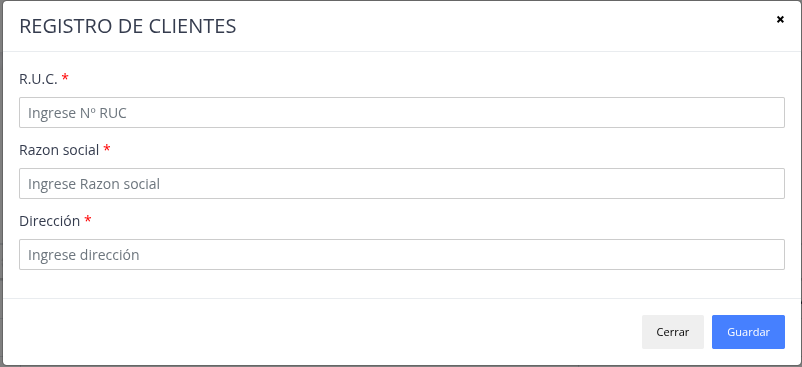
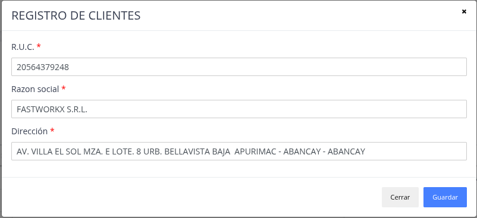

# Clientes Juridicos

Lista de clientes que no son una empresa, solo valido con RUC etc.

## Registrar nuevo cliente jurídico

> ### Presione la opción "Agregar cliente"

> ### Datos del formulario

> ### Nuevo "Cliente Jurídico"

## Actualizar / Eliminar

> ### Actualizar

El sistema brinda  la posibilidad de modificar datos
de un cliente jurídico ya registrado.

> ### Eliminar

Sirve para poder quitar y no utilizar un cliente jurídico.