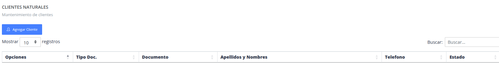
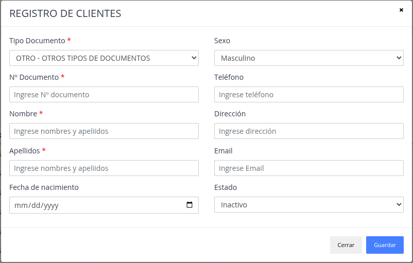
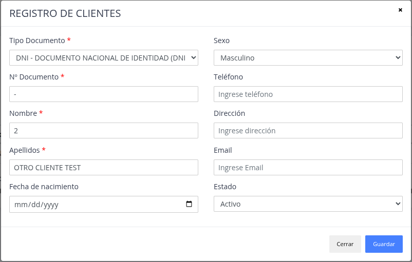
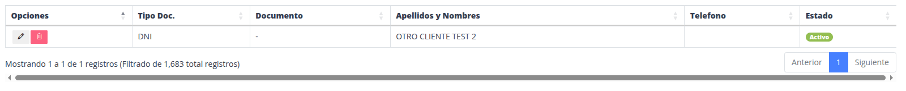

# Clientes Naturales

Lista de clientes que no son son una empresa, sea con dni, ruc como persona natural.
carnet de extranjeria, etc.

## Registrar nuevo cliente natural

> ### Presione la opción "Agregar cliente"

> ### Datos del formulario

> ### Nuevo "Cliente Natural"

## Actualizar / Eliminar

> ### Actualizar

El sistema brinda  la posibilidad de modificar datos
de un cliente natural ya registrado.

> ### Eliminar

Sirve para poder quitar y no utilizar un cliente natural.