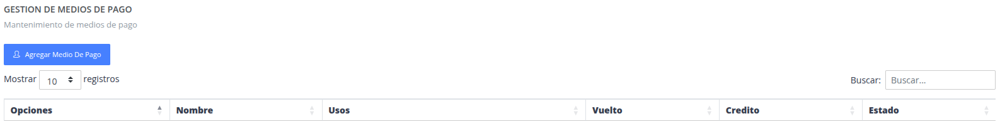
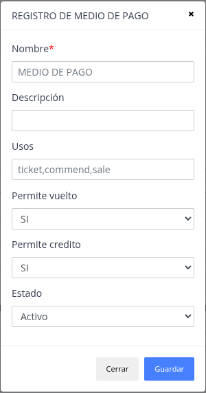
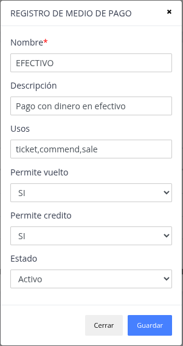
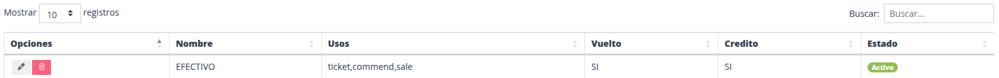

# Medios de pago

Son los tipos de pago disponibles para poder cerrar una venta de las
operaciones que se realizan en el sistema.

## Registrar nuevo medio de pago

Pasos

> ### Presione la opción "Agregar medio de pago"

> ### Datos del formulario

Datos a considerar:

- Usos : para indicar en las operaciones en los cuales se va a admitir el medio de pago.
- Permite credito: para indicar que si se realiza una operacion de tipo Credito admite este medio de pago.

> ### Nuevo medio de pago

## Actualizar / Eliminar

> ### Actualizar

De manera similar al registro, se puede modificar datos
de un medio de pago.

> ### Eliminar

Sirve para poder quitar y no utilizar el medio de pago.