# Rutas y Tarifas

Lista de las rutas del sistema.

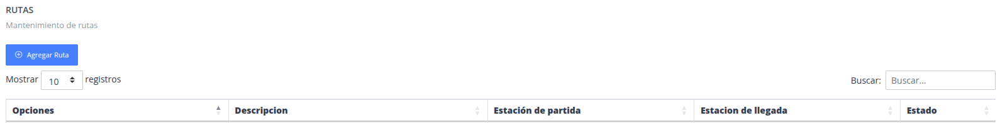

## Registrar nuevo conductor

> ### Presione la opción "Agregar ruta"

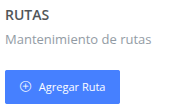

> ### Datos del formulario

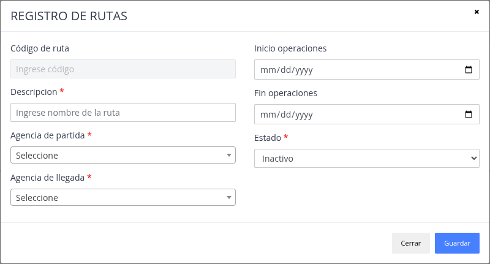

> ### Nueva "Ruta"

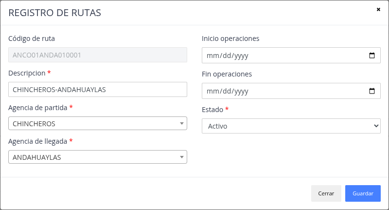

## Funciones adicionales

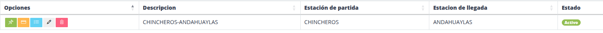

> ### Ver intervalo de operaciones
 
Funcionalidad que permite indicar si la ruta tiene intervalos de días de la semana para poder ser utilizado
para el manejo de operaciones.

> #### Registro intervalo por ruta

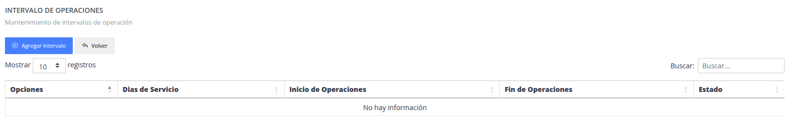

> #### Formulario registro de intervalos

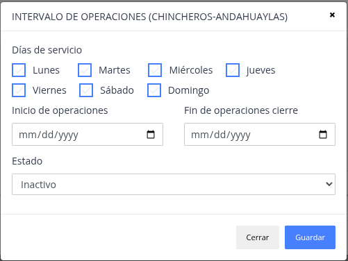

> ### Tarifas/Precios

Funcionalidad de poder asignar precios a las rutas por operación de tipo viajes y encomiendas.

#### Registro de tarifas por rutas (Pasajes)

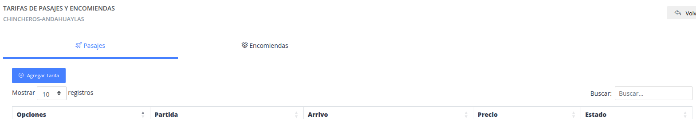

#### Formulario Tarifa Pasajes

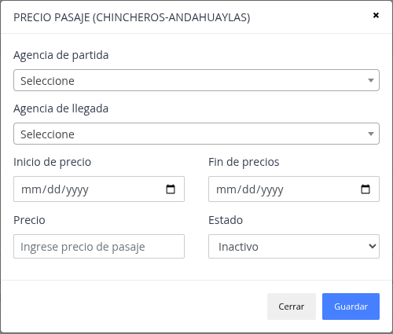

#### Registro de tarifas por rutas (Encomiendas)

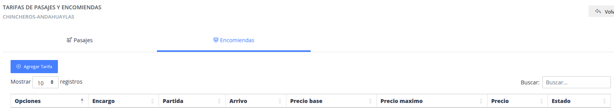

#### Formulario Tarifa Encomiendas

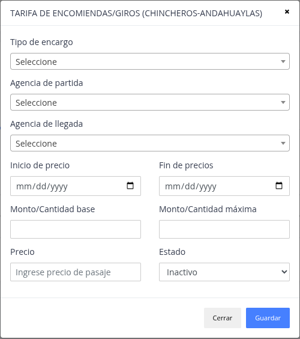

> ### Detalle de ruta

Son los detalles para una ruta, como lo es estaciones intermedias entre 
la ruta principal, asi como el tiempo estimado de llegada a cada estación.

#### Registrar detalle ruta 

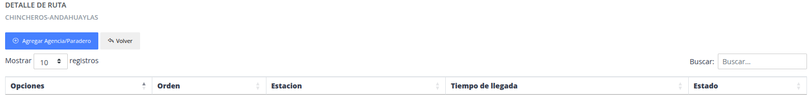

#### Formulario registro detalle

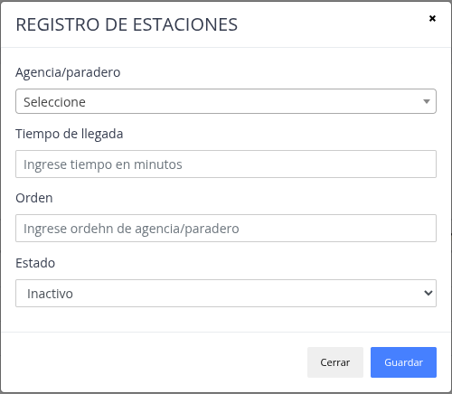

> ### Actualizar

El sistema brinda  la posibilidad de modificar datos
de una ruta ya registrada.

> ### Eliminar

Sirve para poder quitar del proceso de viajes/encomiendas a una ruta.