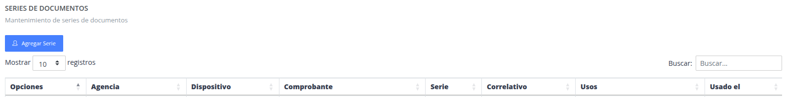
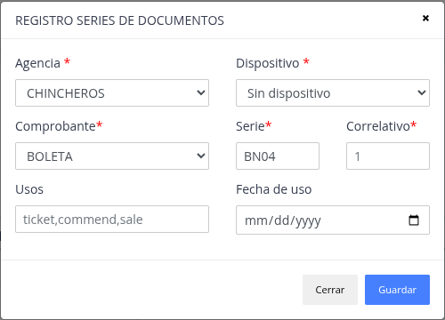
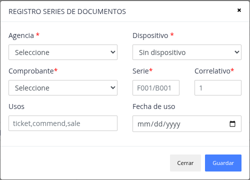
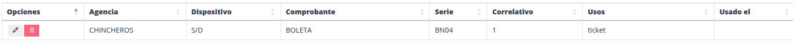

# Series

Son las series de los documentos que se emite/maneja en el sistema,
en el cual se designa en las diferentes operaciones por las agencias
que se tiene.

## Registrar nueva serie

Pasos

> ### Presione la opción "Agregar serie"

> ### Datos del formulario

> ### Nuevo dotos del documento de identidad

## Actualizar / Eliminar

> ### Actualizar

De manera similar al registro, se puede modificar datos
de una serie registrada.

> ### Eliminar

Sirve para poder quitar y no utilizar la serie registrada.