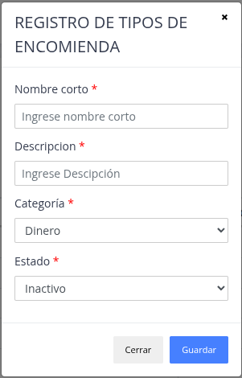
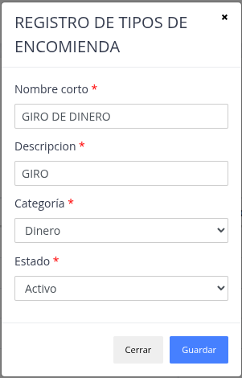

# Tipos de encomiendas

Son la lista de los distintos tipos de encomiendas que se utlizan para el proceso de encomiendas del sistema, su importancia radica para poder generar un reporte mas especifico del la operación de encomiendas.

## Registrar nuevo tipo de encomienda

> ### Presione la opción "Agregar"

> ### Datos del formulario

Datos a considerar:

- Categoria : indica que material es la enocmienda (Dinero, Objecto)

> ### Nuevo "Tipo de encomienda"

## Actualizar / Eliminar

> ### Actualizar

El sistema brinda  la posibilidad de modificar los datos de tipos de encomiendas ya registrados.

> ### Eliminar

Sirve para poder quitar y no utilizar un tipo de encomienda.