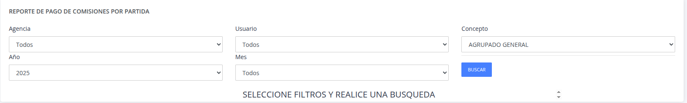
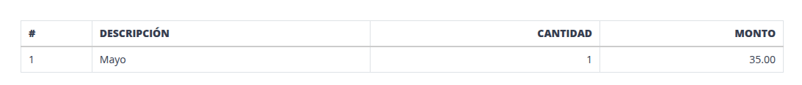
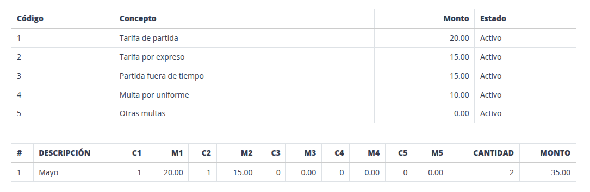
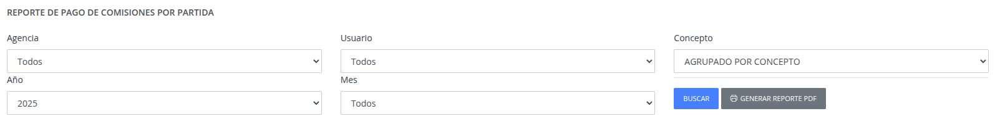
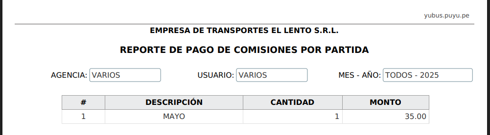
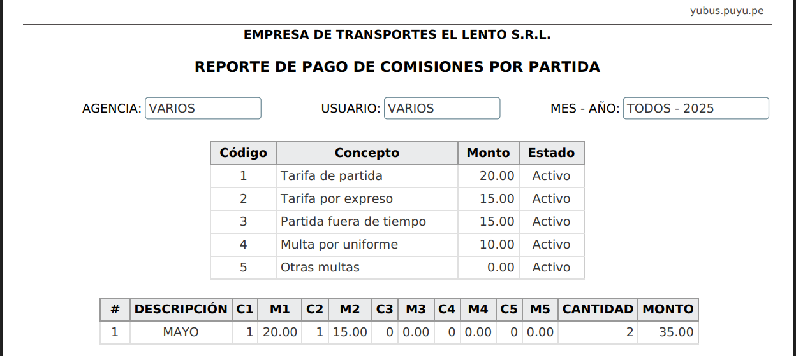

# Comisión por partida

Pasos:

1. [Seleccione los filtros para poder generar el reporte y presionar el boton "BUSCAR".](#1-filtros-reporte-comision-partida)
2. [Se genera una tabla agrupada por meses, cantidad y el total del monto.](#2-tabla-reporte-comision-por-partidas)
3. [Para poder guardar la información mostrada, presione el boton Generar reporte PDF.](#3-generar-reporte-pdf-comision-de-partida)
4. [Se genera el reporte en formato pdf, para poder guardar la información.](#4-reporte-pdf-comision-por-partidas)
###

## 1. Filtros reporte comision partida

## 2. Tabla reporte comision por partidas

> Tabla reporte por agrupación general.

> Tabla reporte por agrupación de conceptos.

## 3. Generar reporte pdf comisión de partida

## 4. Reporte pdf comisión por partidas

> Reporte PDF por agrupación general.

> Reporte PDF por agrupación de conceptos.

