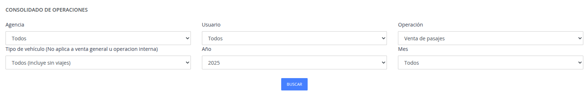
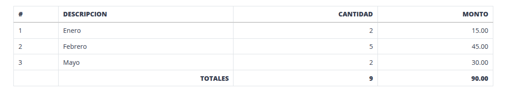
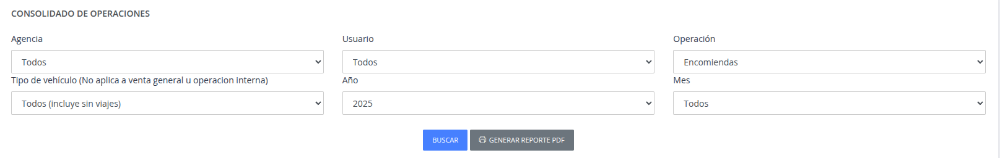
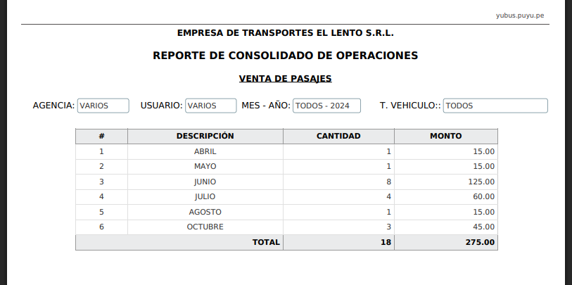

# Consolidado

Pasos:

1. [Seleccione los filtros para poder generar el reporte y presionar el boton Buscar.](#1-filtros-reporte-consolidado)
2. [Se genera una tabla agrupada por meses, cantidad y el total del monto.](#2-tabla-reporte-consolidado)
3. [Para poder guardar la información mostrada, presione el boton Generar reporte PDF.](#3-generar-reporte-pdf-consolidado)
4. [Se genera el reporte en formato pdf, para poder guardar la información.](#4-reporte-pdf-consolidado)
###

## 1. Filtros reporte consolidado

## 2. Tabla reporte consolidado

## 3. Generar reporte pdf consolidado

## 4. Reporte pdf consolidado

