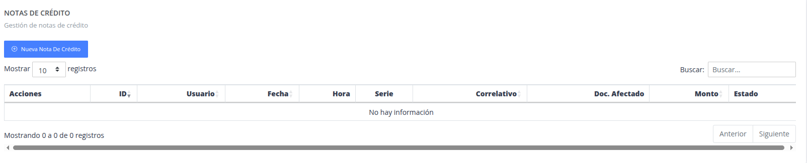
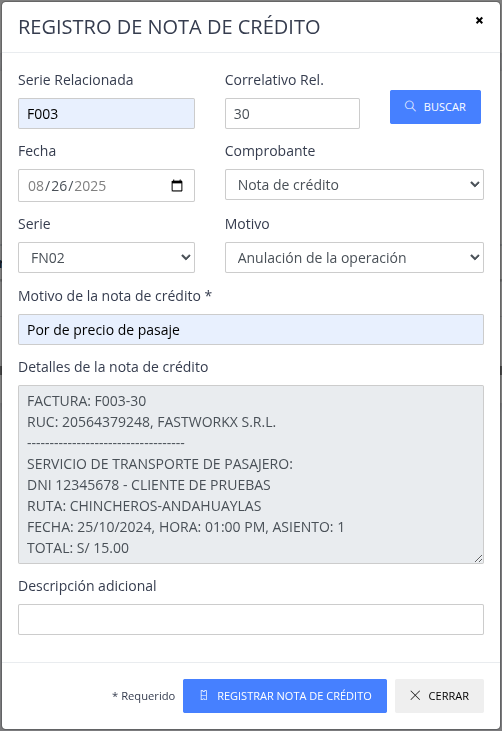
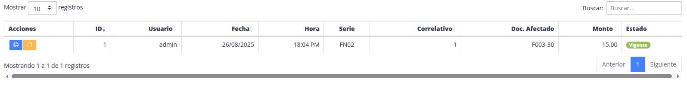

# Notas de Crédito

> Sirve para generar nota de crédito para la anulación de
algun comprobante de pago emitido.

Pasos:

1. [Nueva nota de credito](#1-nueva-nota-de-credito)
2. [Buscar conprobante y registrar datos](#2-buscar-comprobante-y-registrar-datos)
3. [Lista  de notas de credito](#3-lista-de-notas-de-credito)

## 1. Nueva nota de credito

    
## 2. Buscar comprobante y registrar datos

## 3. Lista de notas de credito

### Acciones

- Ver PDF : Mostrar la nota de credito en el servicio Nexus.
- Ver en Nexus : Poder mostrar directamente la nota de credito en formato pdf.