# Operaciones

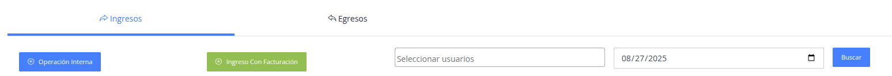

Filtros generales:

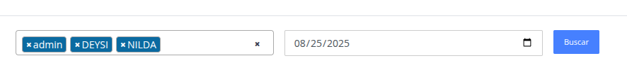

- Seleccionar usuario: seleccion multiple para filtrar los ingresos realizados por algún usuario(s) en específico.
- Fecha de la lista de ingresos/egresos realizados en el sistema.

## Ingresos

> Se tiene 2 modos de registro de ingresos en el sistema.

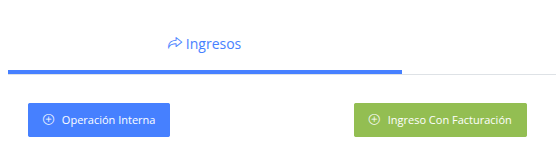

### Operación interna

> Son registros de ingresos cuyos montos de manejan de manera interna del
negocio.

Pasos:

1. Seleccione el boton Operación interna.
2. Complete el formulario y presione el boton guardar.
####
   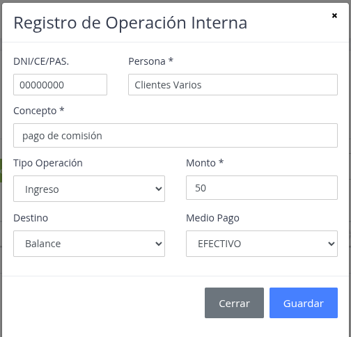

### Ingreso con Facturación

> Son registros cuyos montos son declarados medienate un comprobante de pago
electrónico, sea un documento interno o declarable ante la SUNAT.

Pasos:

1. Seleccione el botón Ingresos con facturación.
2. Complete el formulario para registrar y presione el botón guardar
####
   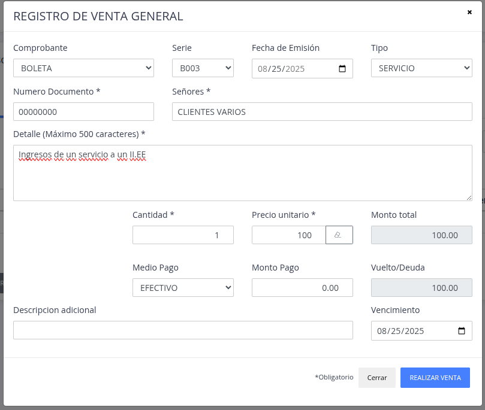

## Egresos

> Se tiene 2 modos de registro de egresos:

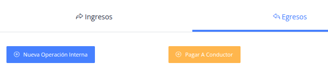

### Nueva Operación interna

> Son registros de egresos/gastos cuyos montos de manejan de manera interna del
negocio.

Pasos:

1. Seleccione el boton Nueva operación interna.
2. Complete el formulario y presione el boton guardar.
####
   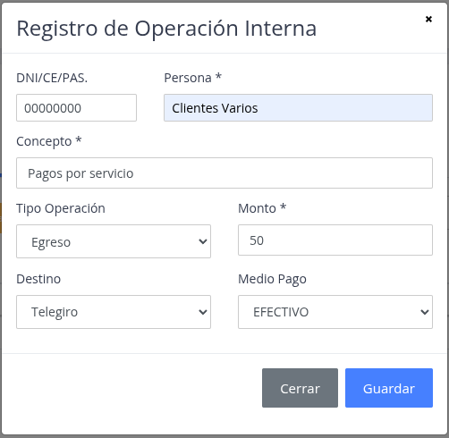

### Pagar a conductor

> Son gastos que se realizan para pagar a los conductores por el servicio de conducción.

Pasos:

1. Seleccione el botón Pagar a conductor.
2. Seleccione el conductor para poder generar el monto del pago.
3. Presione el boton pagar con el monto mostrado.
####
   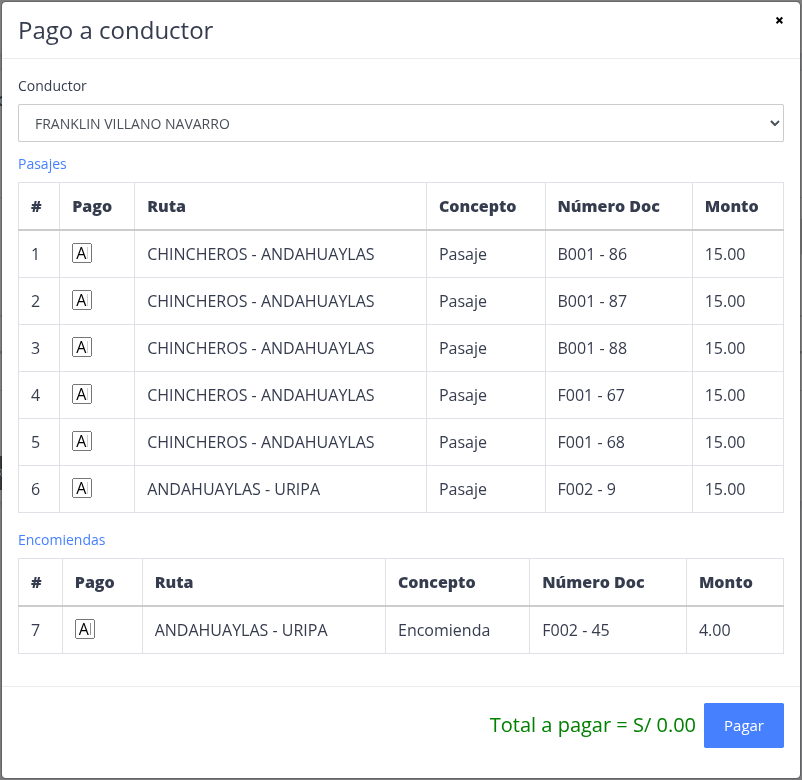

## Reportes

> Se tienen 2 formas de generar un reporte de las operaciones de ingreso/egreso del sistema.

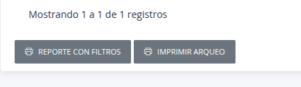

### Reporte con filtros

> De forma similar al anterior, nos permite generar un reporte
> más especifico de los detalles que solo se desea apreciar, tales como
> tipo de operacion, generar por usuarip, tipo de encomienda, etc.

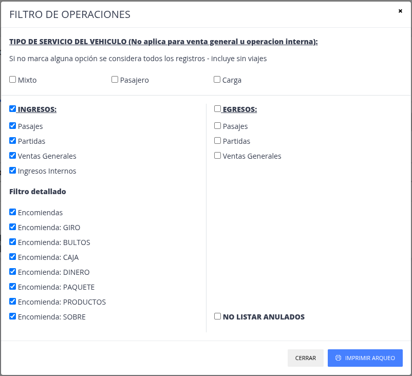

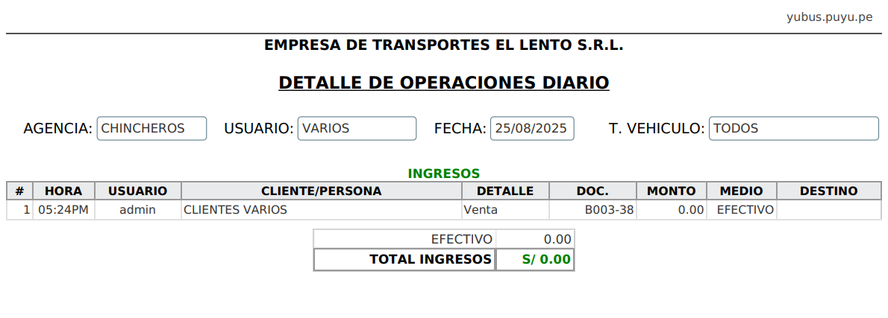

### Imprimir Arqueo

> Reporte general de ingresos/egresos generados del dia a dia de las operaciones del sistema.

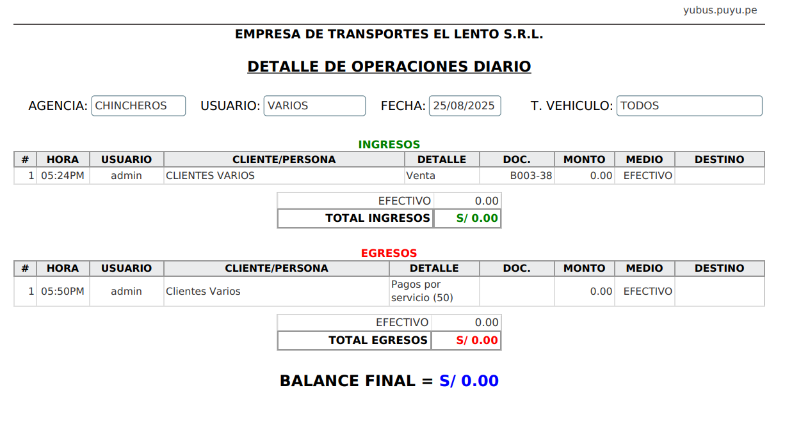