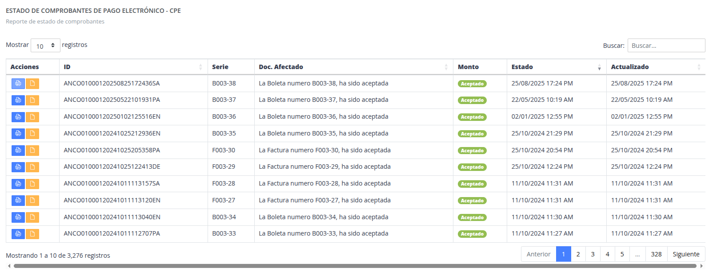

# Estado de comprobantes

> Es una lista general de documentos emitidos desde el sistema

## Acciones

- Buscar : Poder realizar buscar en la lista por algun valor de la tabla.
- Ver PDF : Mostrar el documento emitido en el servicio Nexus.
- Ver en Nexus : Poder mostrar directamente el documento emitido en formato pdf.