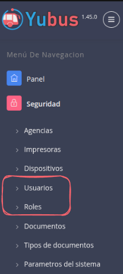
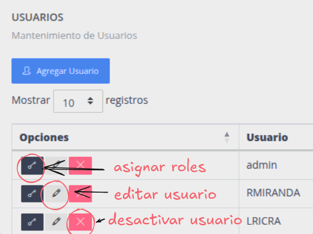
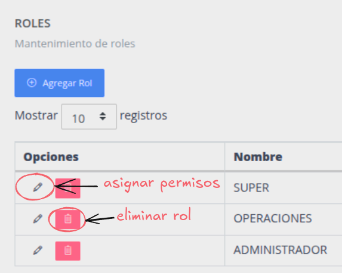

# Gestión de usuarios y roles

## Gestión de usuarios

Operaciones disponibles:

* Agregar nuevo usuario
* Asignar rol a un usuario
* Editar usuario
* Desactivar usuario

## Gestión de roles

* Agregar nuevo rol
* Asignar o quitar permisos a un rol
* Eliminar rol

``