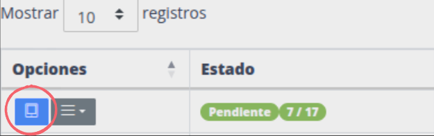
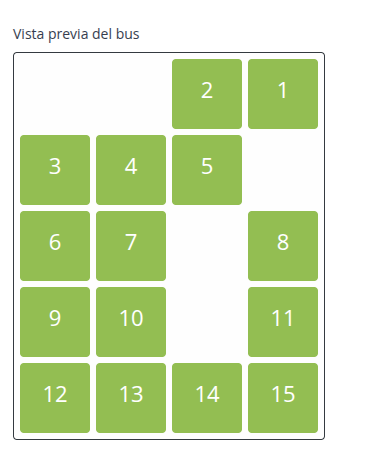
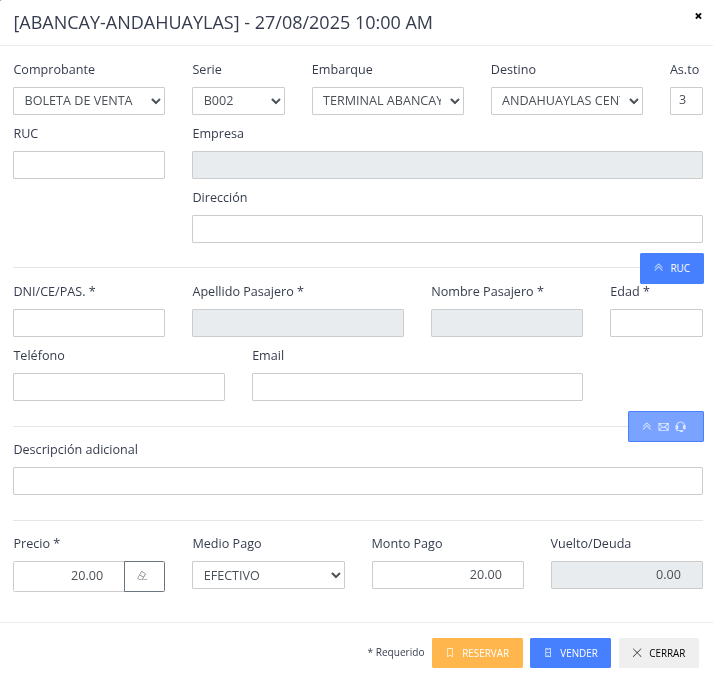
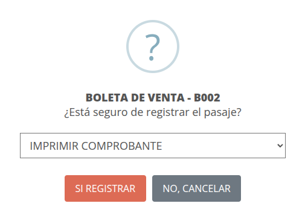

# Venta de pasajes

Pasos:

1. [Ir a viajes y pasajes](#ir-a-viajes-y-pasajes)
2. [Ir a detalles de viaje](#ir-a-detalles-de-viaje)
3. [Seleccionar asiento](#seleccionar-asiento)
4. [Completar formulario](#completar-formulario)
5. [Confirmmar venta](#confirmar-venta)

## Ir a viajes y pasajes

## Ir a detalles de viaje

## Seleccionar asiento

## Completar formulario

> * Ingresar DNI pasajero.
> * Si comprobante es factura, el ruc es obligatorio, para los demas es opcional.
> * Apellidos y nombres se autocompletan según DNI.
> * Teléfono, email y descripción son opcionales.
> * Click en vender si todo esta correcto.

## Confirmar venta

