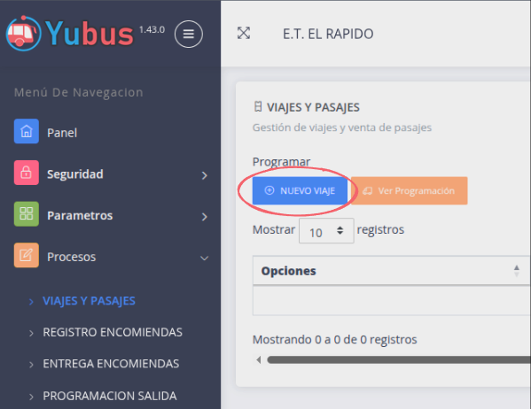
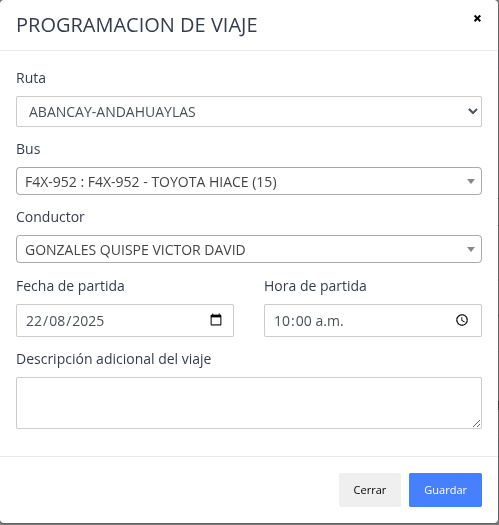

# Programar viaje

Pasos:

1. [Ir a Viajes y pasajes.](#1-viajes-y-pasajes)
2. [Click boton "NUEVO VIAJE."](#2-boton-nuevo-viaje)
3. [Completar formulario y guardar.](#3-completar-formulario)

## 1. Viajes y pasajes

## 2. Boton nuevo viaje

## 3. Completar formulario

