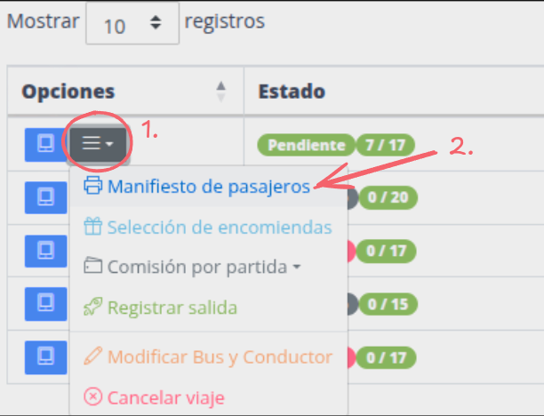
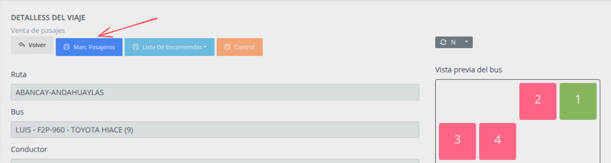
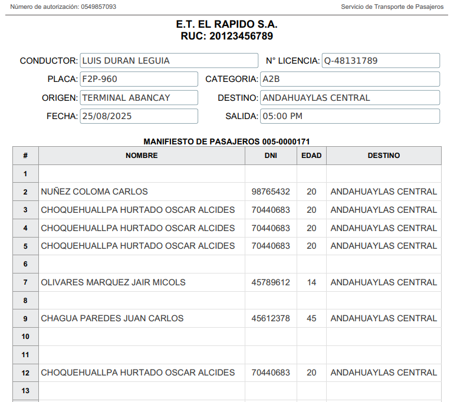

# Manifiesto de pasajeros

En ocaciones sera necesario que los conductores lleven un registro de las personas que estan
viajando, para ello el sistema puede generar un documento llamado "Manifiesto de pasajeros".

Pasos:

1. [Ir a viajes y pasajes](#ir-a-viajes-y-pasajes)
2. [Opción 1](#opción-1) 
3. [Opción 2](#opción-2) 

## Ir a viajes y pasajes

## Opción 1

Click boton menu de opciones luego manifiesto de pasajeros

## Opción 2

Ir a ventana de venta de pasajes

> 1. Click en boton azul en la lista de viajes
> 2. Click en "Man. Pasajeros"

## Resultado

