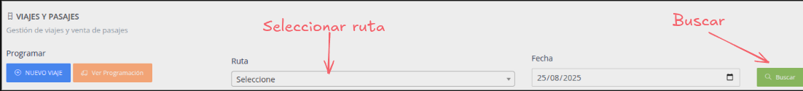
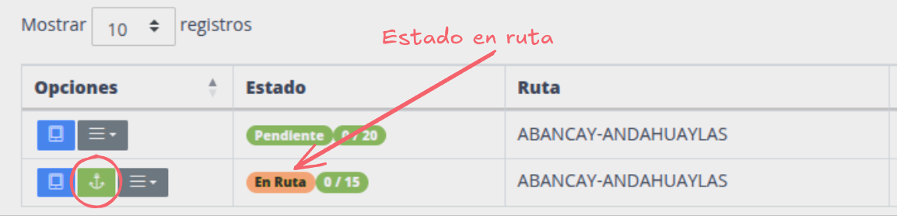
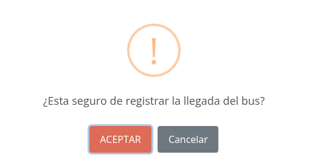

# Registrar llegada

Desde la agencia destino se puede registrar en el sistema la llegada de un bus y finalizar el viaje

Pasos:

1. [Ir a viajes y pasajes](#ir-a-viajes-y-pasajes)
2. [Filtrar por ruta](#filtrar-por-ruta)
3. [Click boton registar llegada](#click-boton-registrar-llegada)
4. [Confirmar llegada](#confirmar-registro-de-llegada)

## Ir a viajes y pasajes

## Filtrar por ruta

> Buscar la ruta según la agencia correspondiente

## Click boton registrar llegada

> Buscar el viaje con estado "En Ruta" y click en el boton verde con icono de ancla

## Confirmar registro de llegada

