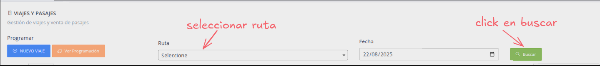
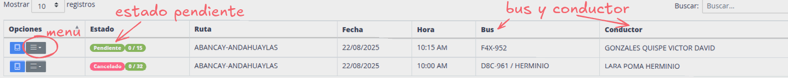
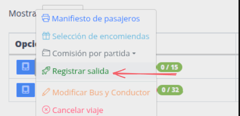
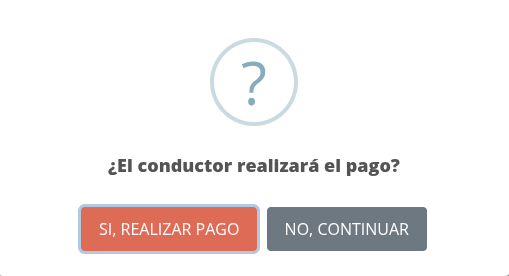
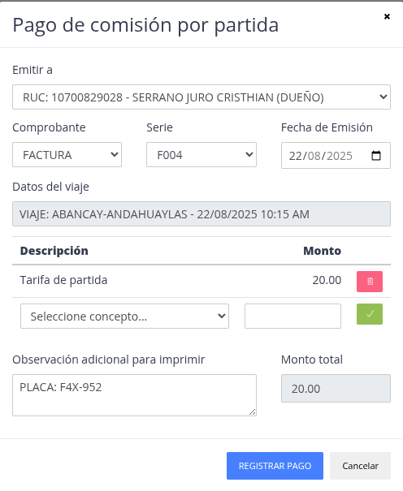
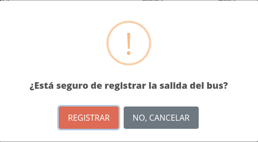

# Registrar salida

Despues de realizar [venta de pasajes](../tickets/sell_ticket.md) y/o [registro de encomiendas](../packages/register_package.md)
podemos registrar la salida del bus.

Pasos:

1. [Ir a viajes y pasajes](#viajes-y-pasajes)
2. [Buscar por ruta y fecha](#buscar-por-ruta-y-fecha)
3. [Click en boton de opciones](#click-en-boton-de-opciones)

## Viajes y pasajes

## Buscar por ruta y fecha

> 1. Seleccione la ruta según su agencia.
> 2. La fecha ya esta configurada con la fecha de hoy.
> 3. Click en buscar.

## Click en boton de opciones

> 1. Identificar el viaje con estado "pendiente" y bus, conductor correspondiente.
> 2. Idientificado el viaje, click en el menu opciones (boton plomo asociado al viaje).
> 3. Buscar la opción "Registrar salida", hacer click.

## Registrar comisión por partida

Si el conductor debe realizar un pago por **"comisión por partida"**, entonces click en
**"SI, REALIZAR PAGO"**, de lo contrario **"NO, CONTINUAR"**

### Formulario comisión por partida

- Se puede agregar mas conceptos
- Una vez verificado la información, click en **"REGISTRAR PAGO"**

## Registrar salida bus

