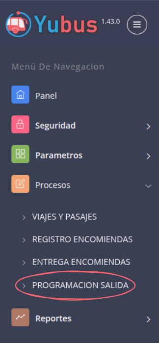
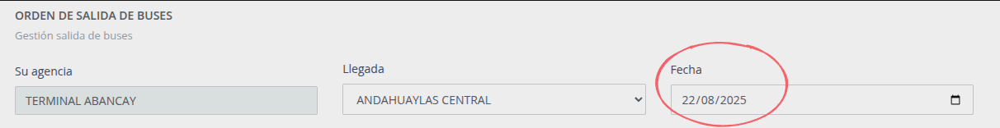
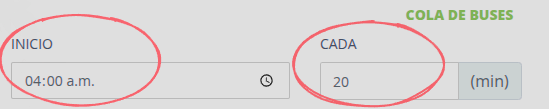
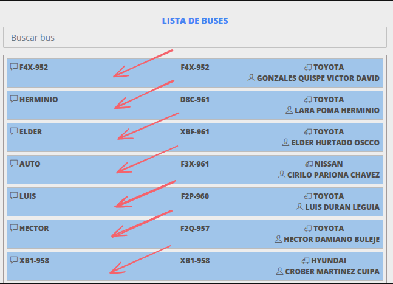
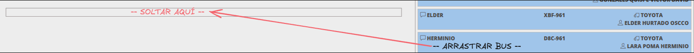
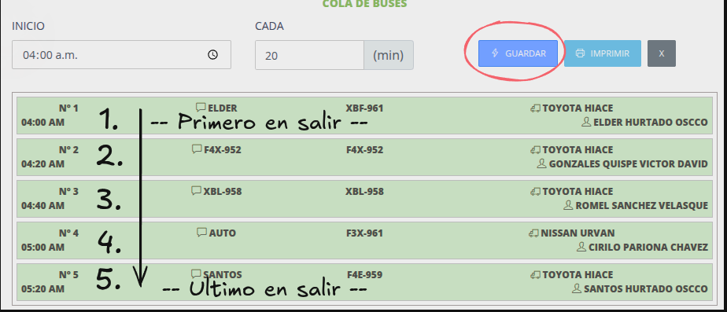

# Viajes programados

Pasos:

1. [Ir a Programación salida.](#programación-salida)
2. [Seleccionar fecha.](#seleccionar-fecha)
3. [Seleccionar inicio.](#seleccionar-hora-de-inicio)
4. [Doble click ](#opción-1-doble-click) o [Arrastrar y soltar buses.](#opción-2-arrastrar-y-soltar)
5. [Guardar y verificar orden de salida](#guardar-y-verificar-orden-de-salida-)

## Programación salida

## Seleccionar fecha

## Seleccionar hora de inicio

> Seleccionar la hora de inicio y programar intervalo de tiempo para la salida de cada bus.

> Ejm: A las 4 a.m. empieza a salir el primer bus y cada 20 minutos iran saliendo los demas.

## Opción 1 Doble click

> Doble click en algun elemento de "LISTA DE BUSES".

## Opción 2 Arrastrar y soltar

> Arrastrar y soltar con el mouse.

## Guardar y verificar orden de salida  

> Click en el boton "Guardar", al gurdar la lista pasa a color verde. Verificar el orden de salida de los buses.

> En caso de agregar nuevos buses o modificar el orden de salida, hacer click nuevamente en "Guardar", para guardar los cambios.